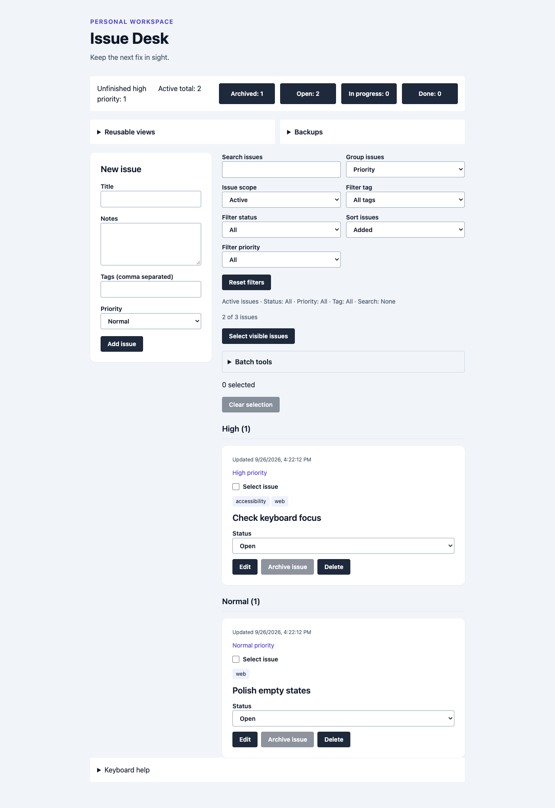

# Cairn

*Keep the next fix in sight.*

Cairn is a browser-local tracker for a small personal backlog. Tag and group
active work, archive completed issues, reuse saved views, and keep portable
backups.



## Brand and design

A cairn is a stack of stones that marks a trail, so each issue is a marker on
the way to done. The mark is three stacked stones with a painted trail blaze on
top.

- **Palette:** warm stone neutrals, plus a *blaze* orange for primary actions and
  high priority. *Dusk*, *ochre* and *moss* mark Open, In progress and Done.
  Every color is an HSL token in `src/styles.css`, with light and dark sets.
- **Type:** Fraunces (display) and Inter (interface), bundled locally through
  Fontsource. The app makes no network requests.
- **Components:** [shadcn/ui](https://ui.shadcn.com) conventions (`components.json`,
  `cn()`, `class-variance-authority`, lucide icons) live in `src/components/ui`.
  Form controls are native elements styled as shadcn components, such as
  `NativeSelect` and a native `Checkbox`. They keep platform accessibility,
  mobile pickers and scriptable tests.
- **Theme:** Cairn follows the system color scheme. The header toggle overrides
  it and saves the choice as `cairn-theme`.

## Run

Use Node 20 and npm:

```sh
npm ci
npm run dev
npm test
npm run build
```

The development server binds to loopback. No account, backend, or external
service is needed. React 18.3, TypeScript 5.8, Vite 6.2, and Tailwind 3.4 are
pinned with their transitive dependencies, as are the shadcn/ui support
packages and fonts.

## Work with issues

- Create issues with notes, priority, and up to five tags. Search title, notes,
  and tags; combine status, priority, tag, and active/archive filters.
- Sort by title, priority, added order, or update time. Unknown legacy update
  times sort last. Group results by status or priority.
- Archive completed issues to keep active work focused. Archived records keep
  their contents; restore them before editing. Archive and restore work in batches.
- Select visible results to change status, priority, or tags in one storage
  write. A tag limit failure leaves the entire batch unchanged. Finish editing
  before batch actions. Undo the last successful batch; later issue changes
  invalidate undo, while no-op batches preserve it.
- Save, reorder, duplicate, rename, and update up to 12 named views. Export and
  import views separately; name and ID collisions receive new values.
- Alt+N focuses the title and Alt+F focuses search. Cancel editing or clear a new
  draft to reset the editor. Unfinished edits warn before leaving; browser and
  system shortcut or unload behavior can vary.

## Backups and recovery

Export all issues, visible results, or a text count summary. Issue backup
filenames include scope and UTC date. Paste JSON, preview it, and confirm an
additive import. Existing issue IDs are skipped rather than replaced. View
backups use a separate format and never change issues.

The list accepts 500 issues, 100-character titles, 1,000-character notes, and
five-million-character issue backups. Tags are normalized to lowercase and allow
24 characters each. Views allow 40-character names, 200-character searches, and
100,000-character backups. Larger legacy issue lists remain readable; export
filtered subsets of at most 500 records. Export validation matches import.

Storage keys and backup formats keep their original names so existing data
still loads after the rename. Issues retain `issue-desk-v1`; views use
`issue-desk-views-v1`. Legacy issues are
active with no tags, Normal priority, and an unknown update time. Older views
use active scope and no grouping or tag filter. Invalid storage is preserved
and changes are blocked; download unreadable issue storage as text for manual
recovery. Raw recovery text is not necessarily a valid backup.

Failed writes retain the entered form and current data. Writes detect changes
made since this tab loaded or last saved. On a conflict, export your current
list and reload. This is a stale-write check, not transactional synchronization;
use one active tab. Clearing browser data removes work. Keep backups and avoid
sensitive information.

## Verification

Unit/component tests cover schema limits, legacy records, tags, queries,
archive eligibility, grouping, atomic batches and undo, view backups, storage
conflicts, editor protection, recovery, and download failures. CI runs tests and
build with pinned actions. Browser scripts use an external Playwright runtime
and current Chrome against a running app:

```sh
ISSUE_TEST_URL=http://127.0.0.1:8602 node tests/browser.cjs
node tests/archive-browser.cjs
node tests/views-browser.cjs
node tests/mobile-browser.cjs
```

Set `ISSUE_TEST_URL` for a different server. The three newer suites default to
port 8602; the original suite retains its 8502 default. Browser coverage includes
reload, backups, view collisions, archive/restore, keyboard focus, and 375px
layouts. The screenshot uses nonpersonal sample issues.

## Dependency maintenance

The pinned toolchain has known advisories; review and upgrade dependencies before deploying a public service.
